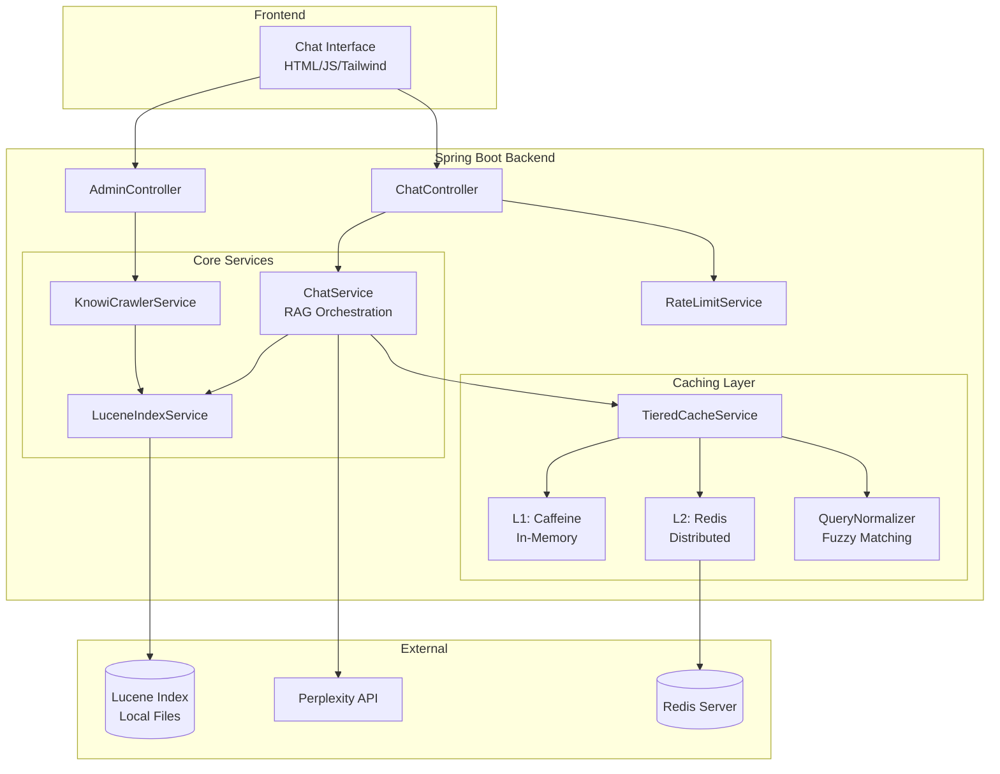
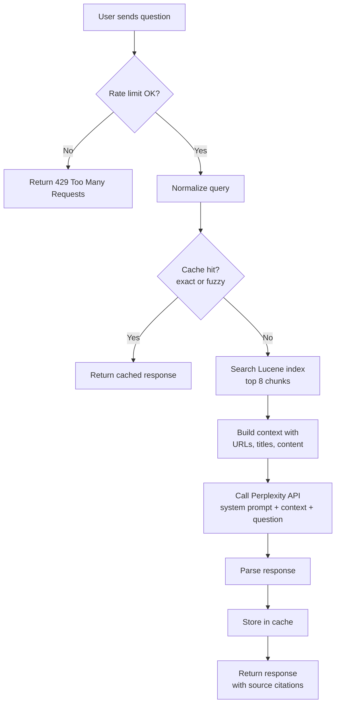
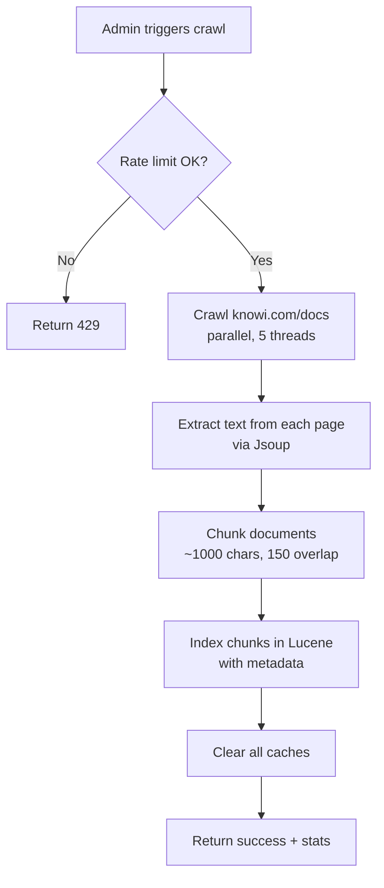
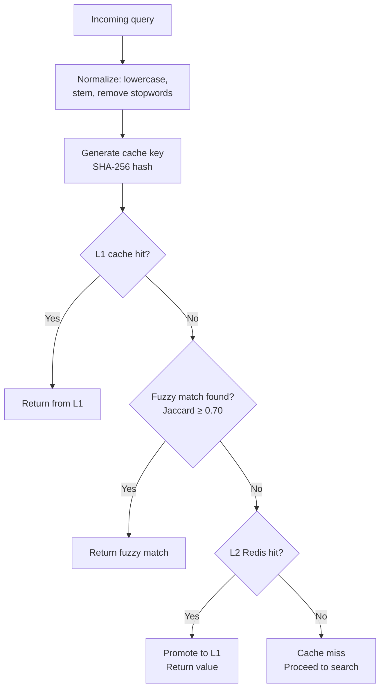

# Knowi Documentation Chatbot

[](https://github.com/Internalizable/knowi-search/actions/workflows/build-and-release.yml)
[](https://github.com/Internalizable/knowi-search/releases/latest)
[](https://openjdk.org/projects/jdk/21/)
[](https://spring.io/projects/spring-boot)
[](LICENSE)

A documentation chatbot for Knowi that uses RAG (Retrieval-Augmented Generation) to answer user questions. Built with Java/Spring Boot, Apache Lucene for search, and Perplexity AI for response generation.

## Demo

[](https://youtu.be/NdJ3eiAYjRc)

## What This Does

Users ask questions about Knowi in a chat interface. The system searches through indexed documentation, pulls relevant chunks, sends them to Perplexity AI with the user's question, and returns an answer with source citations.

## System Architecture



## Request Flows

### Chat Flow



### Ingestion Flow



### Cache Lookup Flow



## Design Decisions

### Why Lucene Instead of Elasticsearch or a Vector DB?

I looked at a few options:

**Elasticsearch** would work but it's way more than I need here. You have to run it as a separate process, manage clusters, deal with configuration. For a single server docs chatbot that's just extra headaches for no real gain.

**Vector embeddings** like Pinecone or Weaviate are popular right now but they don't make sense for documentation search. People searching docs use specific terms like "dashboard" or "widget" or "query". They're not writing poetry, they want exact matches. Keyword search handles this fine. Vector search adds API calls, latency, and cost without giving me much back.

**Simple in memory search** is too basic. No way to rank results by relevance, no stemming, falls apart once you have more than a few documents.

Lucene is the right fit. It runs inside the app so there's no network calls to slow things down. It has BM25 ranking built in which is the industry standard for relevance scoring. Stemming and fuzzy matching work out of the box. Wikipedia uses it. Stack Overflow uses it. It's proven.

The search looks at multiple fields and gives extra weight to title matches:

```java
BooleanQuery.Builder builder = new BooleanQuery.Builder();
builder.add(boostQuery(titleQuery, 2.0f), SHOULD);  // titles matter more
builder.add(chunkQuery, SHOULD);
builder.add(headingsQuery, SHOULD);
```

### Why Two-Tier Caching with Fuzzy Matching?

Perplexity API calls cost money and take 1 to 2 seconds. Users ask the same thing in different ways:

- "How do I create a dashboard?"
- "how to create dashboard"
- "creating dashboards in knowi"

If I just did exact string matching on the cache key, each of these would be a miss and I'd pay for three API calls when one would do.

So I normalize queries before looking them up. I use Lucene's text analysis pipeline for this:

1. Lowercase everything
2. Remove stop words like "how", "do", "I", "a"
3. Apply Porter stemming so "creating", "creates", "created" all become "creat"
4. Expand synonyms so "chart", "visualization", and "graph" are treated the same

Then I compare the token sets using Jaccard similarity:

```
Query: "how to create dashboard"  → tokens: {creat, dashboard}
Cached: "creating a new dashboard" → tokens: {creat, new, dashboard}

Jaccard = intersection / union = 2 / 3 = 0.67
```

If the similarity is 0.70 or higher, I return the cached response.

**Why two tiers?**

L1 is Caffeine, an in memory cache. Lookups take less than a millisecond. No network involved.

L2 is Redis. It survives app restarts and if you're running multiple instances behind a load balancer they all share the same cache.

When a request comes in I check L1 first. If that misses I check L2. If L2 has it I copy it to L1 for next time. New responses get written to both.

### Why Token Bucket for Rate Limiting?

Simple rate limiting like "100 requests per minute" has a problem. A user could send 100 requests at 11:59:59 and another 100 at 12:00:01. That's 200 requests in 2 seconds even though technically they stayed under the limit.

Token bucket fixes this. You get tokens that refill at a steady rate and each request uses one. You can burst a little but you can't game the window boundaries.

I used Bucket4j because it's the go to library for this in Java.

| Endpoint | Limit | Reason |
|----------|-------|--------|
| `/api/chat` | 20/min per IP | AI calls cost money |
| `/api/admin/ingest` | 5/hour per IP | Crawling is expensive |
| General API | 30/min per IP | Basic abuse protection |
| Global | 1000/min total | Safety net for the whole system |

If you run multiple instances the rate limiter can use Redis so the limits are shared across all of them.

### Why RAG Instead of Fine-tuning?

Fine tuning a model on Knowi docs would mean:
- Preparing training data which takes forever
- Paying for training compute
- Retraining every time the docs change
- The model "knows" stuff but can't tell you where it learned it

RAG is way simpler. I just crawl the docs, index them, and retrieve relevant chunks at query time. If the docs change I recrawl and I'm done. The sources are right there in the response so users can verify things themselves.

The downside is context window limits but Knowi's docs aren't huge. 8 chunks at around 1000 characters each fits fine in Perplexity's context.

### Chunking Strategy

Documents get split into chunks of about 1000 characters with 150 characters of overlap between them.

Why 1000? It's small enough that I can fit several chunks in the context window but big enough that each chunk actually contains useful information. If you go too small like 200 to 300 characters you lose context. If you go too big like 2000+ you end up retrieving chunks that are mostly irrelevant with just a small relevant part.

Why overlap? Sometimes the answer to a question sits right at the boundary between two chunks. With overlap both chunks will have that text so I'm more likely to find it.

### Why Jsoup for Crawling?

Jsoup is what everyone uses for HTML parsing in Java. It handles messy HTML without complaining, has nice CSS selector support for grabbing specific elements, and deals with timeouts and redirects properly.

The crawler runs 5 threads in parallel to speed things up. For each page it grabs the HTML, pulls out the main content (skipping navigation and footer and scripts), and finds links to other pages to crawl next. It stays within the knowi.com/docs path so it doesn't wander off into random parts of the site.

## Project Structure

```
src/main/java/me/internalizable/knowisearch/
├── KnowiSearchApplication.java      # Entry point
├── config/
│   ├── CacheConfig.java             # Cache bean wiring
│   └── PerplexityConfig.java        # RestClient setup
├── controller/
│   ├── ChatController.java          # POST /api/chat
│   ├── AdminController.java         # /api/admin/* (ingest, stats, cache clear)
│   └── WebController.java           # HTML page routing
├── service/
│   ├── ChatService.java             # Main RAG logic
│   ├── LuceneIndexService.java      # Search + indexing
│   └── KnowiCrawlerService.java     # Web crawler
├── cache/
│   ├── types/
│   │   ├── TieredCacheService.java  # L1 + L2 coordination
│   │   ├── LocalCacheService.java   # Caffeine wrapper
│   │   └── RedisCacheService.java   # Redis wrapper
│   ├── QueryNormalizer.java         # Lucene-based normalization
│   └── StatisticalCacheService.java # Interface with stats
├── ratelimit/
│   ├── RateLimitService.java        # Facade
│   ├── LocalRateLimiter.java        # Bucket4j + Caffeine
│   └── RedisRateLimiter.java        # Bucket4j + Redis
└── dto/                             # Request/response records
```

## Running Locally

**Prerequisites:** Java 21+, Gradle

```bash
./gradlew bootRun
```

Or build a JAR:

```bash
./gradlew build
java -jar build/libs/knowi-search-0.0.1-SNAPSHOT.jar
```

**First-time setup:**
1. Go to `http://localhost:8080/admin/dashboard`
2. Click "Crawl & Index" to ingest Knowi docs
3. Go to `http://localhost:8080` and ask questions

**Configuration (application.properties):**

```properties
# Required
perplexity.api-key=${PERPLEXITY_API_KEY}

# Crawler
knowi.docs.base-url=https://www.knowi.com/docs/
knowi.docs.max-pages=100
knowi.docs.chunk-size=1000
knowi.docs.chunk-overlap=150

# Cache
cache.local.max-size=500
cache.local.ttl-minutes=30
cache.similarity-threshold=0.70

# Redis (optional - falls back to local-only if unavailable)
spring.data.redis.host=localhost
spring.data.redis.port=6379
cache.redis.enabled=true

# Rate limits
rate-limit.chat-requests-per-minute=20
rate-limit.ingest-requests-per-hour=5
```

## Tech Stack

| Component | Choice | Why |
|-----------|--------|-----|
| Framework | Spring Boot 3.4 | Standard Java web framework |
| Search | Apache Lucene 9.12 | Fast, runs in process, no setup needed |
| AI | Perplexity API | Good at answering questions from docs |
| L1 Cache | Caffeine | Really fast in memory cache |
| L2 Cache | Redis | Shared cache that survives restarts |
| Rate Limiting | Bucket4j | Token bucket with Redis support |
| Crawler | Jsoup | Standard HTML parser |
| Frontend | Thymeleaf + Tailwind | Simple server rendered pages |
| Build | Gradle | Faster builds than Maven |

## API Endpoints

| Method | Path | Description |
|--------|------|-------------|
| POST | `/api/chat` | Send a question, get an answer |
| GET | `/api/admin/stats` | Index and cache statistics |
| POST | `/api/admin/ingest` | Trigger crawl + reindex |
| POST | `/api/admin/cache/clear` | Clear all caches |
| GET | `/` | Chat UI |
| GET | `/admin/dashboard` | Admin panel |

